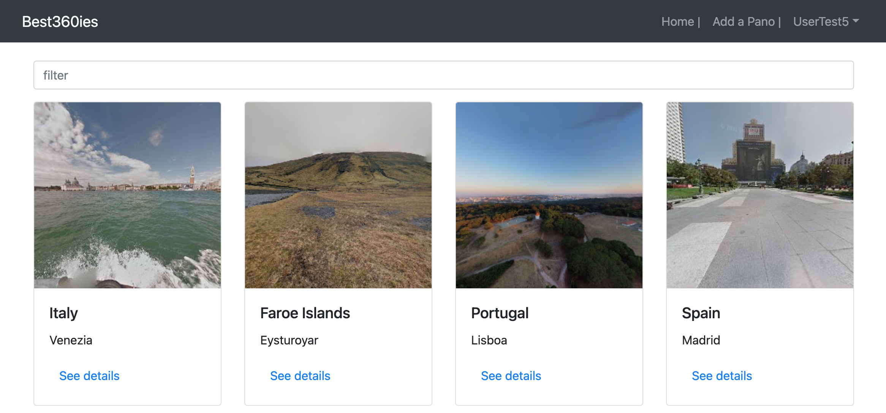

---

# 1. Project description

**Best360ies** is a **full stack web app Project** that consists of an **API** (best360ies-api) as well as a **Frontend App** (best360ies-front-react) built using React library.

Best360ies is a library of 360 panoramic images.

This project gives the user the possibility to add a new 360 (panoramic image) entry into the database along with associated data such as the 360 static image url, the country where the 360 was taken etc... automatically using JavaScript code as well as some third party API to implement the necessary reverse geocoding functionality.

This App is the **Client side** of the **Best360ies Project**. (see below for details regarding the REST API and database)

It makes use of **React Library** as well as **Redux**.

---

# 2. User Stories

- As a user, I want to **be able to browse a collection of 360 panoramic images**, **access to information on 360 panoramic image** such as country, area name, link to the 360 view on google maps so I can **discover interesting places from around the world**.
- As a User, I want to **be able to create a profile** so I can **save data about my favorite 360 panoramic images** and hence **create a sort of personal library of 360 panoramic images**.
- As a registered User, I want to **be able to add new 360 panoramic images to the collection** simply by **pasting the 360 panoramic image URL from google map** so the **user experience is very simple**.
- As a User, I want to be **able search into the 360 panoramic images collection** using the **search bar** so that I can **select only the 360 panoramic images related to a specific area**.

---

# 3. How to get the project running

This App can be executed from the terminal usng the following command: **`npm start`**.
Then open url: http://localhost:1234/

---

# 4. Project main dependencies (e.g., JavaScript version, ESLint rules)

- "axios": "^0.27.2",
- "geojson-places": "^1.0.3",
- "prop-types": "^15.8.1",
- "react": "^18.2.0",
- "react-bootstrap": "^2.5.0",
- "react-dom": "^18.2.0",
- "react-redux": "^8.0.2",
- "react-router-dom": "^5.3.0",
- "redux": "^4.2.0",
- "redux-devtools-extension": "^2.13.9"

---

# 5. API used by the project

Link to the GitHub repository of the API built and used for this Project:

- Best360ies API: https://github.com/xavsln/best360ies-api

---

# 6. Online version

- Best360ies Client online: https://best360ies.netlify.app/

---
